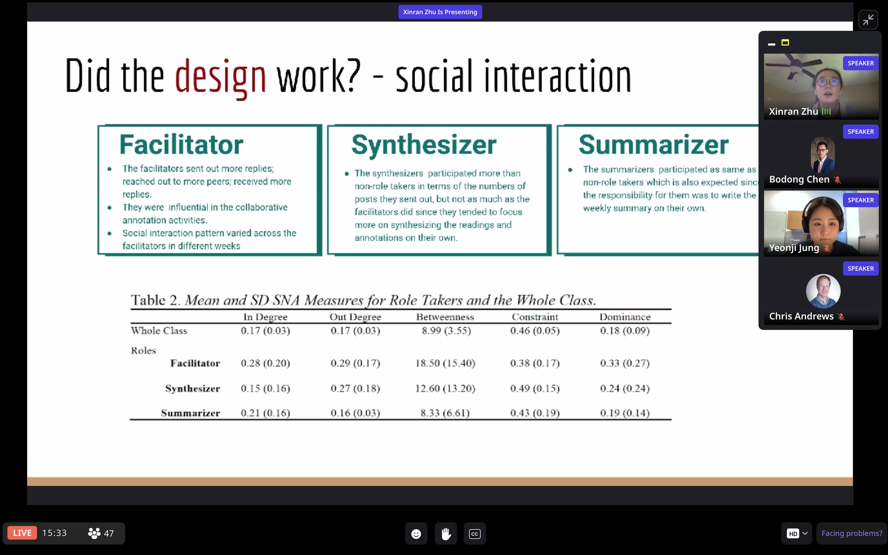

## Synopsis

Social annotation is a genre of information technology that allows a user to annotate information in a shared document and anchor a discussion to the annotated information. When it is used socially in online classrooms, web annotation can support social reading, group sensemaking, knowledge construction, community building, and collaborative learning. 

To support several instructors’ pivot to online teaching since Fall 2020, we conducted the study that was focused on engaging undergraduate students in reading and discussing course materials in online classes through collaborative social annotation activities. Following a co-design approach, we have been working closely with instructors to design supports in both pedagogy and technology for social annotation activities and support them to implement the designs, with course-specific customizations, in their classes. All participating courses are piloting a web annotation tool named [Hypothes.is](https://web.hypothes.is/) that allows students to read and annotate socially. This project is currently moving forward in two directions: 

#### Designing a Generic Scaffolding Framework -- The Participation Roles Strategy

We designed a generic scaffolding framework comprising three scripted participation roles based on the CSCL literature (Strijbos & Weinberger, 2010; Wise et al., 2012). These roles are: a *facilitator* responsible for stimulating conversations by finding connections, seeking clarifications, and encouraging their peers to consistently tag their annotations for an entire week; a *synthesizer* who synthesizes the initial ideas, highlights agreement/disagreement, and suggests directions of further discussions in the middle of the week; and a *summarizer* who summarizes group conversations at the end of the week for the whole class. 

#### Designing Social Annotation Synthesizer (SASy) : a Tool for Knowledge Synthesis 

SASy is a tool for knowledge synthesis in collaborative sense-making and knowledge building. SASy aims to support the creation of knowledge synthesis, which does not only summarize existing ideas but also investigates connections across sources and generates novel knowledge, akin to the notion of “rise-aboves” in knowledge building (Scardamalia & Bereiter, 2014). As a scaffolding tool, SASy emphasizes the indispensability of connecting ideas and guides students through the key steps of making generative synthesis, including searching for relevant ideas, connecting, categorizing and rising above scattered ideas, and writing up the synthesis. 

## Partners

- College of Liberal Arts, University of Minnesota
- School of Public Health, Duke University

## Presentations
- We presented our paper *Designing Support for Productive Social Interaction and Knowledge Co-construction in Collaborative Annotation* at *the 29th International Conference on Computers in Education* in November, 2021.

- Zhu, X., Shui, H., & Chen, B. (2021, June). *Designing Support for Productive Social Interaction and Knowledge Co-construction in Collaborative Annotation*. Panel presentation at the [I Annotate 2021 Conference](https://iannotate.org/2021/), Online. [[**Slides**](../file/IAnnotate2021-Zhu.pdf)]

- We participated the [Liquid Margin](https://web.hypothes.is/liquid-margins/), a show gathers talk about collaborative social annotion hosted by Hypothes.is to share our practice and research. In this eposide, we focused on how learning scientists and instructors can partner to successfully implement and use social annotation in diverse disciplines across higher education.
<iframe width="560" height="315" src="https://www.youtube.com/embed/ut25Dm4eNhk?list=PLmuJEyeapl2ceOSuvT83CwGuJ64ceMaqp" frameborder="0" allow="autoplay; encrypted-media" allowfullscreen></iframe>

## Publications

-  Zhu, X., Shui, H., & Chen, B. (2021). Designing Support for Productive Social Interaction and Knowledge Co-construction in Collaborative Annotation. In Rodrigo, M. M. T. et al. (Eds.). *Proceedings of the 29th International Conference on Computers in Education*. Asia-Pacific Society for Computers in Education. **[Best Student Paper Award & Best Paper Nomination]**
- Zhu, X., Shui, H., & Chen, B. (2020, preprint). A Scaffolding Framework for Social Annotation in Online Classes. EdArXiv. [https://doi.org/10.35542/osf.io/zk4vj](https://doi.org/10.35542/osf.io/zk4vj)
- Zhu, X., Chen, B., Avadhanam, R. M., Shui, H., & Zhang, R. Z. (2020). Reading and connecting: Using social annotation in online classes. Information and Learning Sciences, 121(5/6), 261–271. [https://doi.org/10.1108/ILS-04-2020-0117](https://doi.org/10.1108/ILS-04-2020-0117)
- Chen, B. (2019). Designing for Networked Collaborative Discourse: An UnLMS Approach. TechTrends, 63(2), 194–201. [https://doi.org/10.1007/s11528-018-0284-7](https://doi.org/10.1007/s11528-018-0284-7)
