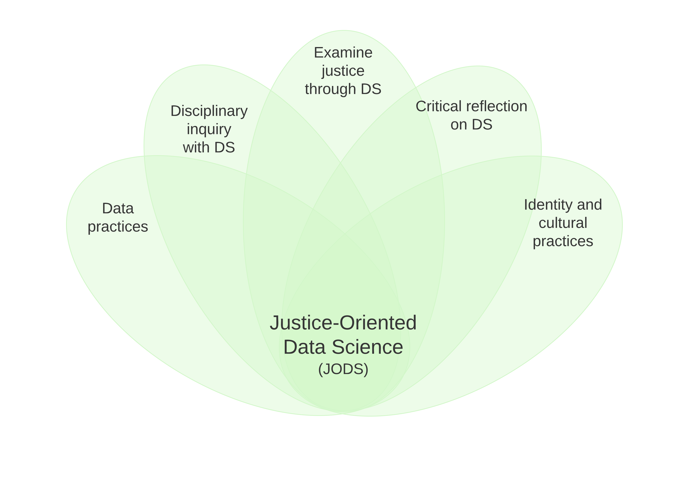

<!-- ## DataX: Exploring Justice-Oriented Data Science with Secondary School Students -->
 

DataX is [an NSF DRK-12 project](https://www.nsf.gov/awardsearch/showAward?AWD_ID=2101413) that aims to develop an integrated, justice-oriented curriculum and a digital platform for teaching secondary students. 

**PIs**: Bodong Chen, Cassie Scharber, David Deliema  
**Graduate Researchers**: Vivian Leung, John Bartucz, Vimal Rao, Tina Jeon  
**Developers**: Benji Encalada Mora

## News

✨ 2024-06, *Supporting Learning Pathways of Justice-Oriented Data Science in Secondary Science and History Classes: Teachers’ Perspectives*, Poster to be presented at the ISLS Annual Meeting. AUTHORS: Bodong Chen, David DeLiema, Cassie Scharber and John Bartucz

✨ 2024-04-14, *[Characterizing Data Literacy Instruction: Content Analysis of a High School Science and Social Studies Textbook](aera2024-textbooks-handout.pdf)*. Paper to be presented at the AERA Annual Meeting, Philadelphia, PA. AUTHORS: Keerthanya Rajesh & Bodong Chen. 

✨ 2023-06-28, [DataX: Toward a Justice-Oriented Data Science Program for Secondary Science and Social Studies](drk12-2023-poster.pdf), Poster presented at the DRK12 PI Meeting, Arlington, VA.

✨ 2023-04-13, [Toward a Framework for Justice-Oriented Data Science Education in K–12 Schools](aera23-datax.pdf), Paper presented at the AERA Annual Meeting, Chicago, IL. 

## Introduction

> Understanding data is critical for informed citizens. Data science is a growing and emerging field that can incorporate statistics, mathematics, and computer science to develop disciplinary knowledge and address societal challenges. This project will develop an integrated, justice-oriented curriculum and a digital platform for teaching secondary students about data science in science and social studies classrooms. The platform will help students learn about data science using real-world data sets and problems. This project includes science and social studies teachers in the design of the resources and in testing them in secondary school classrooms. Research and development in data science education is needed to understand how students can learn more about the use of data in meaningful and authentic ways. This interdisciplinary project will also help students meaningfully analyze real-world data sets, interpret social phenomena, and engage in social change.
> 
> During a two-year project period, we aim to iteratively advance three design components of the DataX program: (a) a justice-oriented data science curriculum integrated in secondary science and social studies; (b) a web-based learning platform that extends the Common Online Data Analysis Platform (CODAP) to support collaboration and sophisticated data practices; and (c) pedagogical practices that involve learners to work collectively as community. The guiding research question is: What scaffolds and resources are necessary to support the co-development of data, disciplinary, and critical literacies in secondary classrooms? To address this, the project will use participatory design research with science and social studies teachers to develop and test the curriculum, the learning platform, and the pedagogical practices. The data collected will include qualitative sources gathered from participatory design workshops and classrooms, as well as quantitative data from questionnaires and system logs. Using the data, we examine students' data science skills, data dispositions, and social participation in collaborative data investigations.

  

## Phase 1: Co-Designing DataX with Teachers

During this phase, the UMN research team is working with three highschool teachers from the St Paul Public Schools to co-design DataX. 

The following DataX components are advanced in tandem through co-design workshops. 

**Click on each section below to expand for details:**

  

  <h3>1. DataX Curriculum</h3>
  👇
  

  <b>Review of Data Science Education Curricula.</b> To inform our design, we have conducted a review of existing Data Science Education Curriculum efforts. See the table below. This review is by no means comprehensive. Please contact us if you have any suggestions.

  <iframe src="https://docs.google.com/spreadsheets/d/e/2PACX-1vSlTSsjpkBhLlN-PG2UOATH2P4h-6Dq19gtiZxMCq0nTKSD3Funjd0VIUyxmGnWQxWqjYmtBYzHyK9w/pubhtml?gid=2142626713&amp;single=true&amp;widget=true&amp;headers=false" width="100%" height="500px"></iframe>

  
<a href="https://docs.google.com/spreadsheets/d/e/2PACX-1vSlTSsjpkBhLlN-PG2UOATH2P4h-6Dq19gtiZxMCq0nTKSD3Funjd0VIUyxmGnWQxWqjYmtBYzHyK9w/pub?gid=2142626713&single=true&output=csv">Download the table in CSV</a>
  

  
<b>Justice-Oriented Data Science Framework.</b> Our curriculum design work is guided by a justice-oriented data science (JODS) framework. This framework includes five synergestic areas:

  
  
1. DS practices. Learners work with data in authentic ways, including wrangling data, making data moves, generating data representations, and interpreting findings.

  
2. Disciplinary inquiry with DS. Learners engage in meaningful disciplinary or interdisciplinary inquiries in which they pose their own questions and answer these questions by analyzing data, while interacting and communicating with others.

  
3. Examine justice through DS. Learners develop their understanding of a range of justice issues (e.g., racial, climate) and their intersections through data investigations; learners mobilize data science to develop tools to tackle justice issues.

  
4. Critical reflection on DS. Learners consider the nature of data science as a field of research and practice, the ways in which fairness and biases are reflected in data science, and connections between data science and societal discourse.

  
5. Identity and cultural practices. Learners see themselves as people who use data for purposes that interest them, recognize connections between data science and themselves and their communities, and identify ways to  engage in data science in culturally congruent manners.

  

  
See details in <a href="aera23-datax.pdf">AERA 2023 presentation</a>. 

  

<!-- 

  

  <h3>1. DataX Curriculum</h3>
  👇
  

-->

  

  <h3>2. DataX Platform</h3>
  👇
  

  We have developed and been continously refining a DataX platform to support the DataX Curriculum. Below is a screenshot of the platform we are currently developing. 

  

## Phase 2: Classroom investigations

This phase approaches the challenge of implementing in the classroom a curriculum that
interleaves the co-designed DataX software, learning activities, and pedagogical practices. 

The research in this phase is directed toward addressing the following questions: (2a) How do the features of DataX learning platform afford, constrain, or impact pedagogical approaches to a social justice-focused data science curriculum? (2b) How do DataX iterations and commonalities and differences within and across content areas (science and social studies) suggest broader opportunities and tensions at the intersection of data science, disciplinary learning, and social justice?

<b>Lesson plans.</b> In collaboration with science and social studies teachers, we designed lesson plans that attempt to integrate these JODS areas for particular disciplinary contexts.

**Classroom pilots.** With our partner schools, we conducted a series of classroom pilots with the designed technology and lessons. The classroom contexts in which DataX has been piloted include:

- Middle-school biology (Minnesota), with a focus on ecosystems
- High-school history (Minnesota), with a focus on US voting rights
- High-school environmental justice (Ohio), with a focus on designing solutions with community partners

----

## Prior Work

Data science has become an integral part of the practice of modern science, technology, engineering and mathematics (STEM), inspiring educators to integrate computing with STEM learning. This project aims to develop a pedagogical model -- *Data Expedition* or *DataX* -- to engage students in building scientific explanations based on real-world open science data, computing, and classroom dialogues. DataX would not only nurture crucial scientific practices emphasized by the Next Generation Science Standards, but also make science learning more connected with real-world problems and aligned with real-world scientific practices.

  

  <h3>Early Exploration (May 2018)</h3>
  👇
  

  
The initial phase of the project was supported by the University of Minnesota Libraries, under its [Research Sprints program](https://www.lib.umn.edu/research-sprints).

During the research sprint, a project team -- made of geospatial data curators, data scientists, and instructional designers -- worked together to identify, retrieve, and preserve a set of open geoscience data to support data expeditions to the Arctic and Antarctic. Over the span of 4 days, we have:

<ul>
  <li>Drafted curriculum-relevant inquiry questions related to the climate change</li>
  <li>Compiled dozens of open datasets related to the climate change</li>
  <li>Cleaned a subset of the identified datasets (appx. 12) and created a data wrangling/cleaning guide for future use</li>
  <li>Imported 8 datasets to the [Common Online Data
Analysis Platform (CODAP)](https://codap.concord.org/) for data expeditions and created 3 'data stories' from these expeditions</li>
  <li>Developed a mockup for the DataExpedition environment</li>
  <li>Created a preliminary pedagogical design for DataExpedition in high school science</li>
</ul>

Special thanks to the awesome project team -- Mariya Gyendina (PM), Lindsay Matts-Benson, Carolyn Rauber, Melinda Kernik, Danny Hanson, Ryan Mattke, and Frank Sayre -- who brought tremendous expertise, curiosity, and willingness to play.

  

  <h3>Prototype Design and Pilots (Jan 2019 - Jun 2020)</h3>
  👇
  

The project is supported by the Grant-in-Aid (GIA) initiative of the Office of the Vice President for Research, University of Minnesota. 

<h4>Co-design with teachers</h4>

In this phase, we are co-designing pedagogical interventions with K-12 teachers.

Partner schools include:

<ul>
  <li>Central High School, St Paul</li>
  <li>Harding High School, St Paul</li>
  <li>Jackman Institute of Child Study Lab School, Toronto</li>
</ul>

<!-- #### DataX platform

We are also developing a DataX platform that supports learners' computational participation across disciplines. Below is a screenshot of the platform we are currently developing. 

 -->

<!-- **We are looking for a talented Research Assistant to lead the DataExpedition tool development!** Please get in touch with Prof. Chen if you are interested.  -->

## Publications

- Chen, B., Bartucz, J., Scharber, C., Rao, V., & DeLiema, D. (2023, April). [Toward a framework for justice-oriented data science education in K–12 schools](aera23-datax.pdf). Paper presented at the AERA Annual Meeting, Chicago, IL.
- Chen, B., Ma, L., & Peebles, B. (2021, June). *Seeing Ourselves in the Data: Situating Data Literacy in Theory Building by Youth*. Paper presented in the "Data Literacy" Structured Poster Session at the 2022 AERA Annual Meeting, San Diego, CA. ([Poster](../file/aera22-data-literacy.pdf))
- Chen, B., & Avadhanam, A. (2021, June). [Integrating Data Science Explorations in Science Classrooms](../file/ISLS2021-datax-final.pdf). Poster presented at the ISLS Annual Meeting 2021, Online. ([Poster](../file/ISLS21_DataX_poster_final.pdf))
- Rosenberg, J., Edwards, A., & Chen, B. (2020). [Getting messy with data: Tools and strategies to help students analyze and interpret complex data sources](https://www.researchgate.net/publication/338926472_Getting_Messy_With_Data). *The Science Teacher, 87*(5), 30–34.
- Chen, B., Ma, L., Peebles, B., & Barbaro, V. (2020, April). *[Data Expedition in a Knowledge Building Community](../file/AERA20-data-science-across-curriculum.pdf)*. Paper presented in the "Exploring Data Science Across the Curriculum and Across Grade Levels" Structured Poster Session at the 2020 AERA Annual Meeting, San Francisco, CA.
