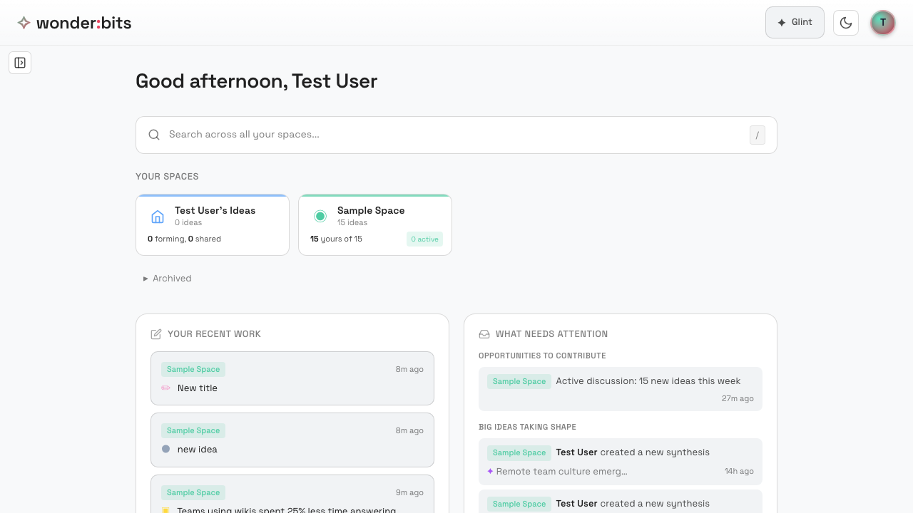
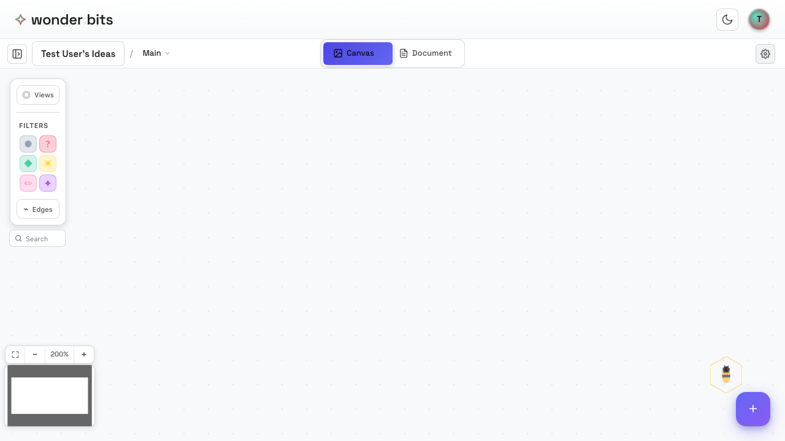

Welcome to Wonderbits! This guide will walk you through the basics of using the app to organize your thinking.

## Your Home Screen

After logging in, you arrive at your home screen. This is your central hub for accessing all your spaces.

*The Wonderbits home screen showing your spaces*

On the home screen, you can see:

- **Your Personal Space** - A private space just for you, created automatically
- **Class Spaces** - Shared spaces for collaboration (if you've joined any)

## Your Personal Space

Every user has a personal space that's created automatically. This is your private thinking area where you can develop ideas before sharing them.

*Your personal space card*

> **Tip:** Your personal space is completely private. Only you can see the ideas you create here.

## Entering a Space

Click on any space card to enter it and start working with ideas.

*The canvas view inside a space*

When you enter a space, you see the **Canvas View** - an infinite canvas where you can place and connect ideas.

Key areas of the canvas:

- **The Canvas** - The main area where your ideas (nodes) live
- **Toolbar** - At the top, with view controls and filters
- **Add Button (+)** - Floating button to create new ideas

## Navigating the Canvas

The canvas is infinite - you can pan and zoom to explore your ideas.

**Pan:** Click and drag on empty space to move around

**Zoom:** Use scroll wheel or pinch gesture to zoom in/out

> **Tip:** Zoom out to see the big picture, zoom in to focus on details and edit content.

