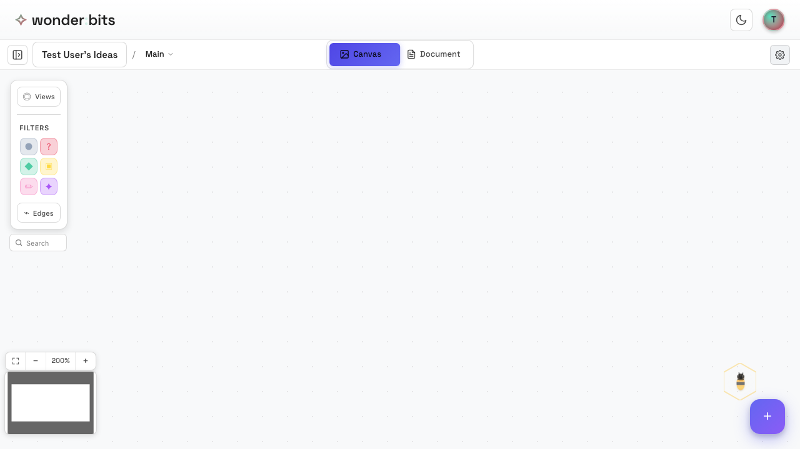
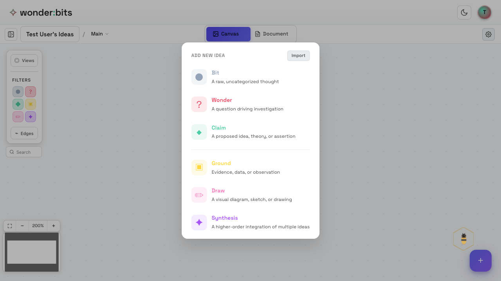
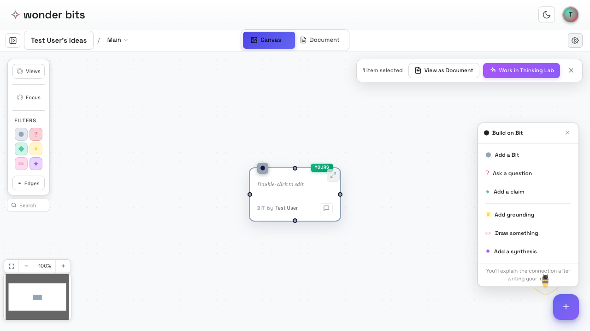
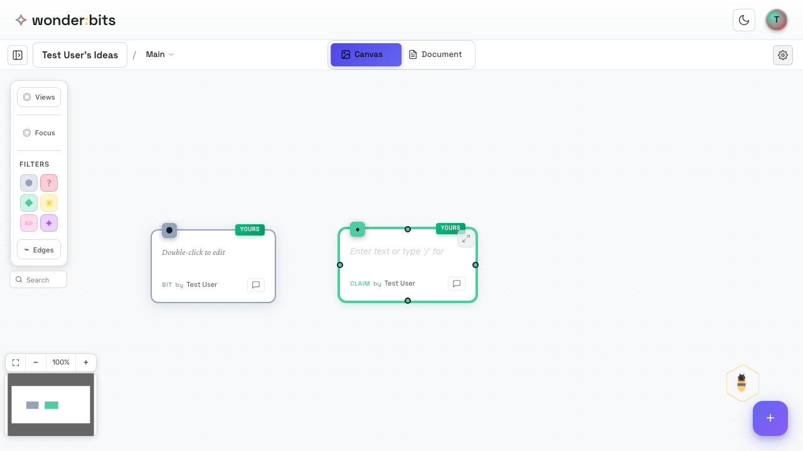
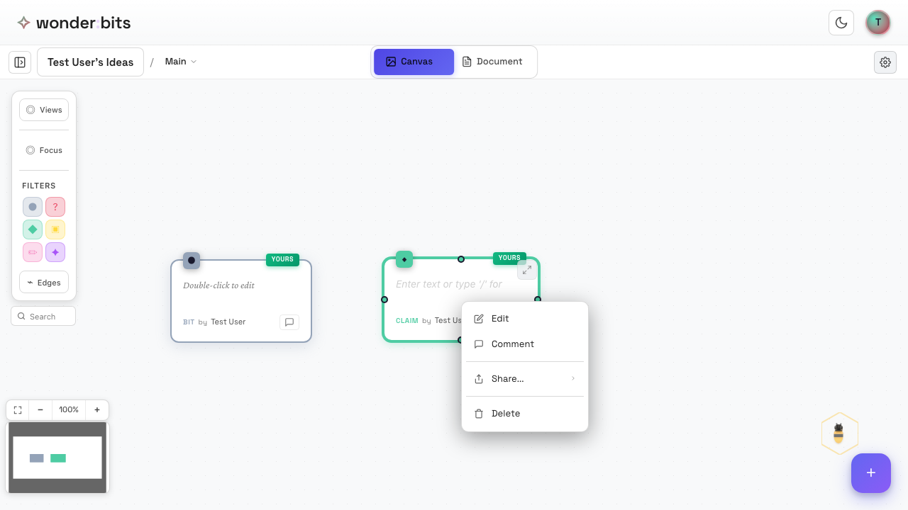

In Wonderbits, your thoughts are represented as **nodes** on the canvas. Each node can have a type that reflects its role in your thinking.

## Adding Your First Idea

To add a new idea to the canvas, click the **+** button (FAB - Floating Action Button).

*The floating action button (+) to add new ideas*

*The type picker showing available node types*

The type picker shows you different types of nodes you can create:

## Understanding Node Types

Wonderbits supports several built-in node types, each serving a different purpose:

### Bit (Untyped)

Use **Bit** nodes for quick thoughts that don't fit a specific category yet. You can always change the type later.

*A Bit node*

### Wonder (Question)

Use **Wonder** nodes for questions you want to explore. Questions drive inquiry and guide your thinking.

- Example: "What makes a good user interface?"
- Example: "How do ecosystems maintain balance?"

### Claim (Statement)

Use **Claim** nodes for statements, assertions, or ideas you want to develop.

- Example: "Visual representations help understanding"
- Example: "Collaboration improves creativity"

*A Claim node*

### Other Node Types

As you advance, you'll discover more node types:

- **Ground** - Evidence, sources, or supporting data
- **Draw** - Sketches and visual diagrams
- **Synthesis** - Higher-level insights combining multiple ideas

## Editing Ideas

To edit an idea, simply double-click on it. Or right-click, then select Edit. The node will enter edit mode where you can:

- Type or modify text content
- Use rich text formatting (bold, italic, lists)

*Right-click context menu for more*

Click anywhere outside the node or hit Cmd+Enter (Ctrl+Enter on Windows) to exit edit mode and save your changes.

## Changing a Node's Type

You can change a node's type at any time. Click on a node type icon in the upper-left corner of a node, then select a new type.

> **Tip:** As your thinking evolves, feel free to change node types. A bit might become a claim as you develop your understanding.

## Recap

In this section, you learned:

1. How to add new ideas using the + button
2. The different node types (Wonder, Claim, Bit, Ground, Synthesis, Draw)
3. How to edit and modify your ideas
4. How to change a node's type

Next, you'll learn how to **connect ideas** to show relationships between them.

