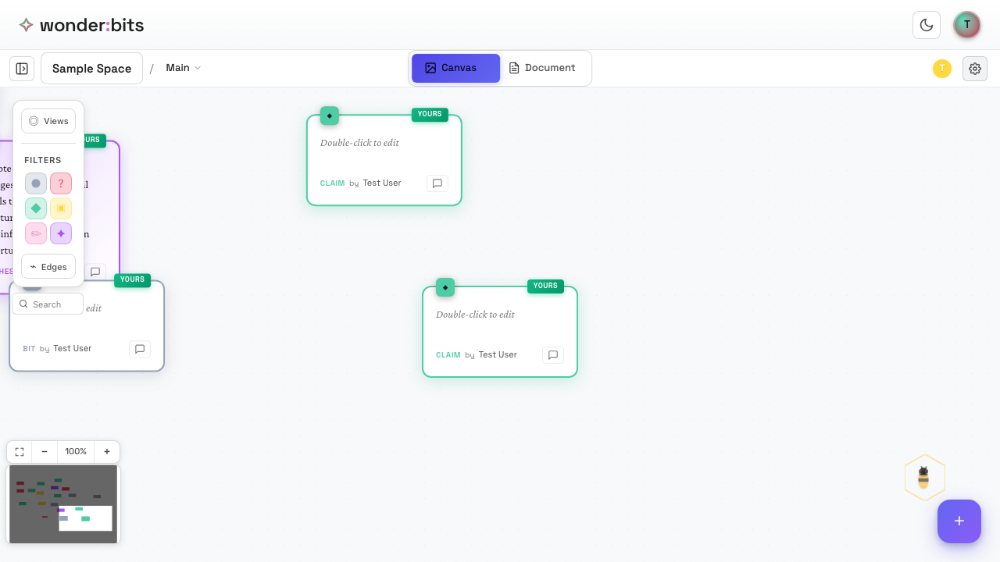
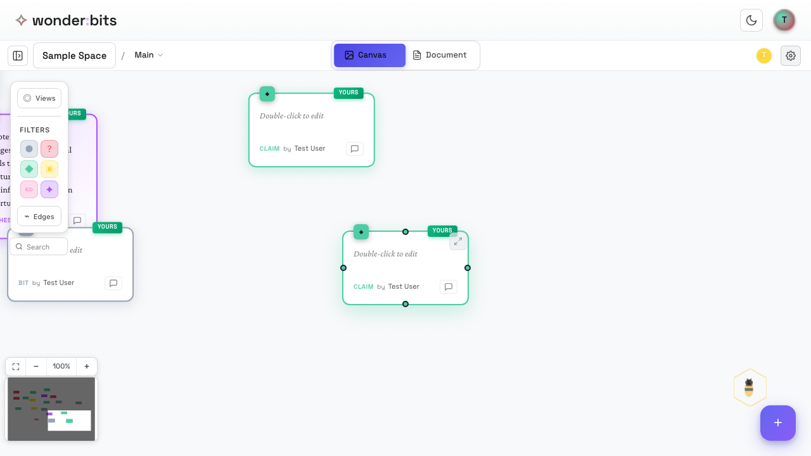
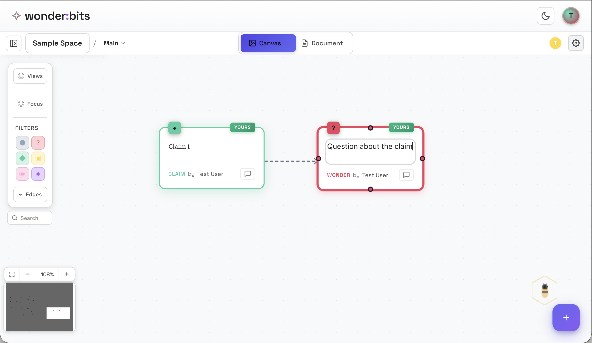

One of the most powerful features of Wonderbits is the ability to connect ideas, showing how they relate to each other.

## Creating Connections

To connect two ideas, you drag from one node's handle to another.

<!-- 
*Two nodes ready to be connected* -->

Each node has **connection handles** that appear when you hover over it. These small circles on the edges of the node are your connection points.

*Connection handles appear when hovering over a node*

### Steps to Connect

1. Hover over the source node to reveal its handles
2. Click and drag from a handle
3. Drag to the target node
4. Release on the target node or its handle

Connections in Wonderbits represent relationships between ideas. They help you:

- Show how ideas support or relate to each other
- Build chains of reasoning
- Create visual maps of your thinking

For each connection, you have the option to add a **rationale** to justify the connection. But this is totally optional. 

## The Build-On Feature

The **Build-On** feature lets you create a new idea that's automatically connected to an existing one. It's perfect for developing a thought further.

*The selection menu with Build-On option*

To use Build-On:

1. Select a node you want to build upon
2. Click the **Build-On** button in the selection menu
3. A new node appears, already connected to your original idea
4. Type your new thought that builds on the original

*A node that builds on another one*

### Adding Rationale

When you build on an idea, you can add a **rationale** - a brief explanation of how the ideas connect. This helps clarify your thinking and makes your reasoning visible.

> **Tip:** Use rationales to explain "why" or "how" ideas connect. This makes your thought process clearer to yourself and others.

## Recap

In this section, you learned:

1. How to connect ideas by dragging between node handles
2. What connections represent (relationships between ideas)
3. How to use Build-On to extend your thinking
4. The importance of rationales for explaining connections
