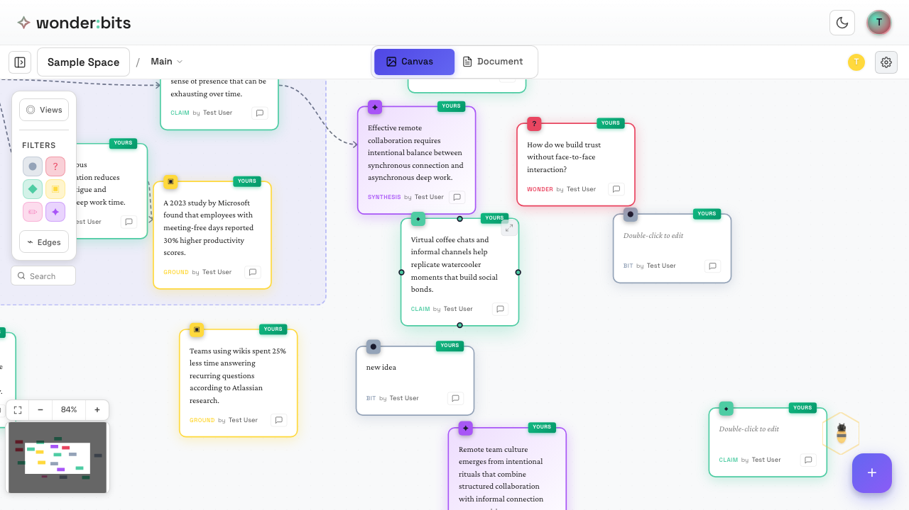
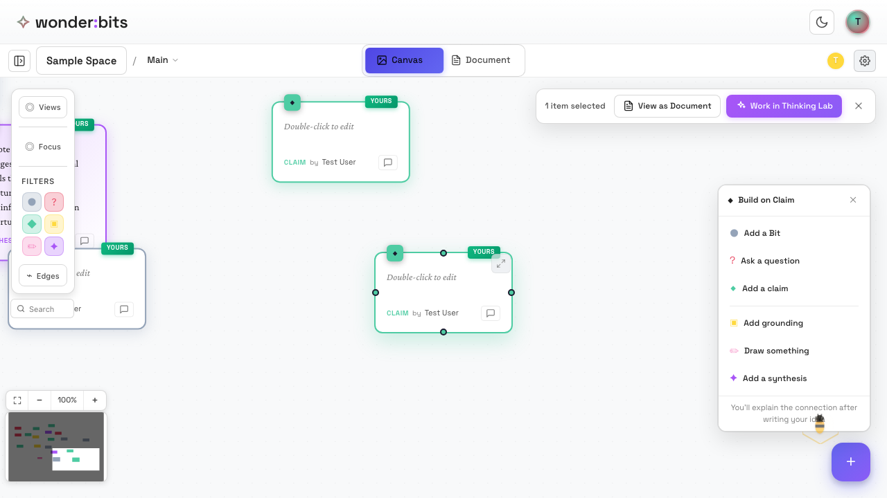
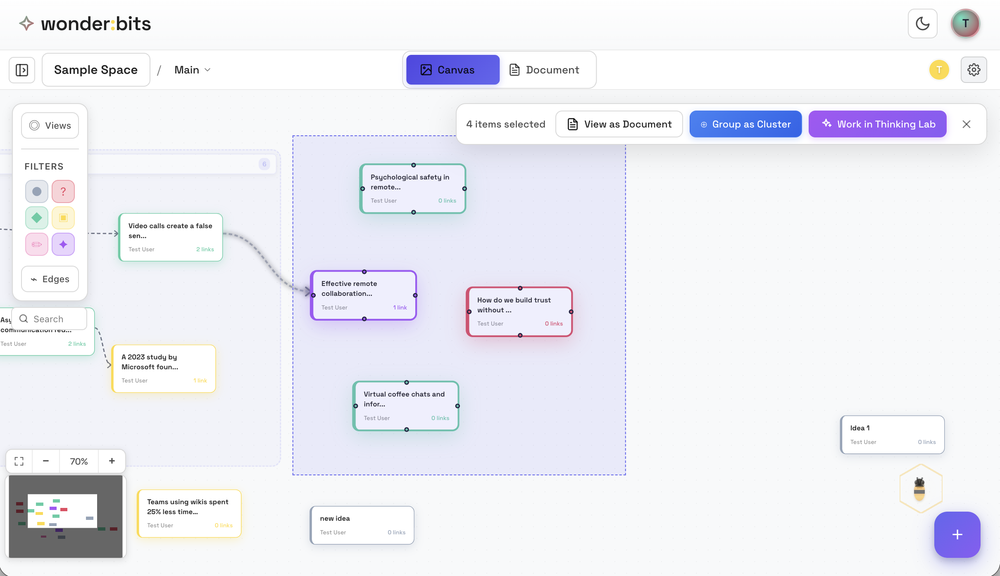
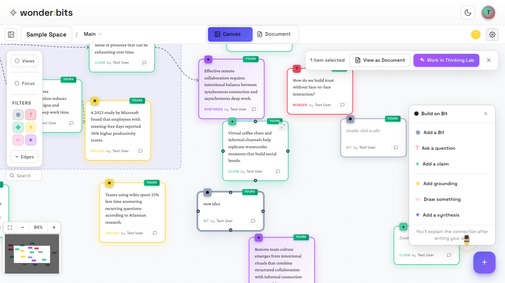
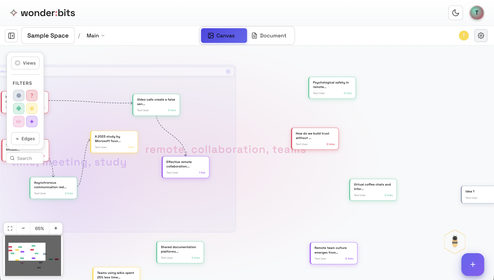
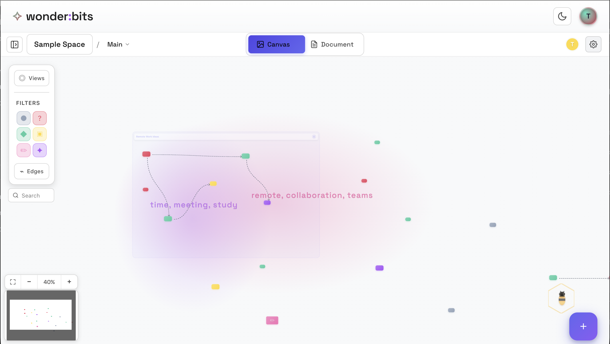

The Wonderbits canvas is an infinite space for your ideas. Learning to navigate it efficiently will help you work with large collections of thoughts.

## Moving Around the Canvas

### Pan (Move the View)

To move around the canvas without moving any nodes:

- **Mouse:** Click and drag on empty space
- **Trackpad (e.g., on Macbook):** One-finger drag on empty space
- **Touch screen:** One-finger drag on empty space

*Drag on empty space to pan around the canvas*

### Zoom

Zooming lets you see more or less of your canvas:

- **Mouse wheel:** Scroll up to zoom in, scroll down to zoom out
- **Trackpad:** Pinch gesture or two-finger scroll
- **Touch screen:** Pinch gesture
- **Zoom controls:** Use the +/- buttons in the bottom-left corner

*Zoom controls in the bottom-left corner*

## Selecting Nodes

### Single Selection

Click on any node to select it. A selected node shows a highlight and reveals additional options.

*A selected node with its selection menu*

### Multi-Select

Select multiple nodes to move or organize them together:

- **Shift+Click:** Add nodes to your selection one by one
<!-- - **Drag selection:** Click and drag on empty space to draw a selection box -->

*Multiple selected nodes with their selection menu*

> **Tip:** Multi-select is useful for moving groups of related ideas together or organizing your canvas.

## Semantic Zoom Levels

Wonderbits uses **semantic zoom** - as you zoom out, nodes change how they display to remain useful at different scales.

### Full Detail View (Zoomed In)

At high zoom levels, you see complete node content with all formatting. This is ideal for reading and editing.

*Full detail view - complete content visible*

### Scan View (Medium Zoom)

At medium zoom, nodes show abbreviated content. Good for scanning and finding specific ideas.

*Scan view - abbreviated content for quick scanning*

### Map View (Zoomed Out)

At low zoom, nodes appear as colored shapes based on their type. Great for seeing the overall structure of your thinking.

*Map view - see the structure of your ideas*

<!-- ### Landscape View (Very Zoomed Out)

At the lowest zoom level, you see a high-level overview of your entire canvas. Useful for understanding the big picture.

*Landscape view - the big picture* -->

## Recap

In this section, you learned:

1. How to pan and zoom around the canvas
2. How to select single and multiple nodes
3. The four semantic zoom levels and when to use each
