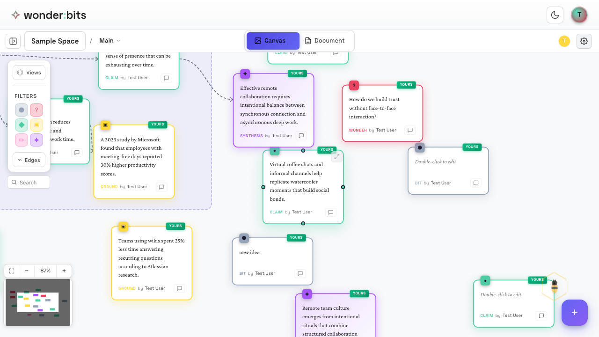
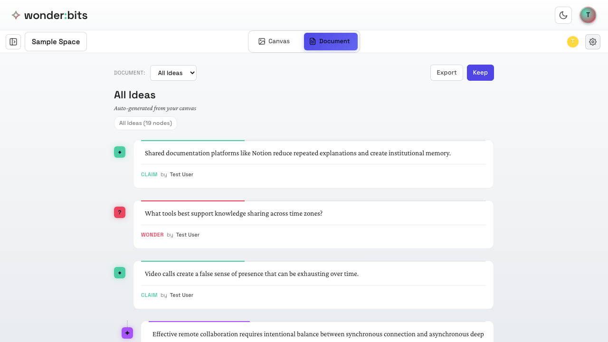
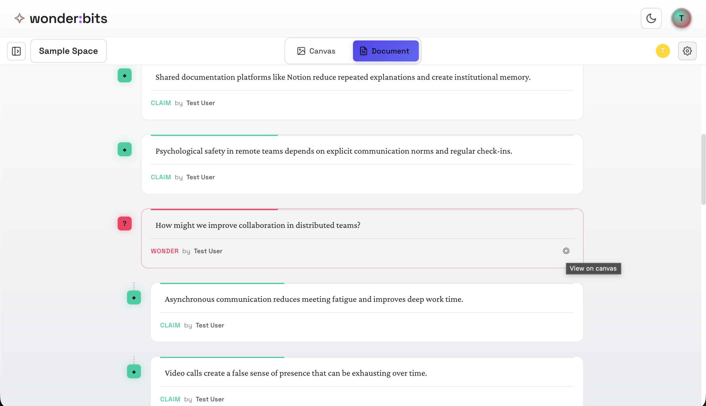
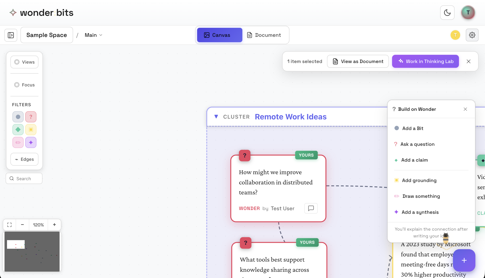

While the Canvas view is great for spatial organization, sometimes you want to see your ideas in a linear format. That's where **Document View** comes in.

*Starting in Canvas view*

## Switching to Document View

The view toggle is located in the top toolbar. Click on **Document** to switch from Canvas view.

<!-- 
*The Canvas/Document toggle in the toolbar* -->

*Document view shows ideas in a linear format*

## When to Use Each View

### Canvas View is For Active Work with Ideas, including:

- Brainstorming and free-form thinking
- Seeing spatial relationships between ideas
- Organizing ideas into clusters
- Getting an overview of your thinking

### Document View is for Reviewing Ideas, including:

- Reading through ideas in sequence
- Following threads of connected thoughts
- Preparing to write or present
- Sharing a narrative with others
- Viewing content on a small mobile screen

## Toggling Back and Forth

You can switch between views at any time. Your ideas remain the same - only the presentation changes.

In the Document view, you can also click on a node to return to the Canvas view.

*Switching back to Canvas view*

When switching back to Canvas view, the node is centered and selected.

*Switching back to Canvas view with the node selected*

There are many other ways to toggle between these two modes, which will be covered in Intermediate or Advanced topics.

> **Tip:** Use Canvas view for writing, exploration, and organization, then switch to Document view when you want to read through your ideas linearly.

## Recap

In this section, you learned:

1. How to switch between Canvas and Document views
2. When each view is most useful
3. That your ideas stay the same regardless of which view you use

---

**Congratulations!** You've completed Part 1 of the Wonderbits tutorial. You now know the basics of creating, connecting, and navigating your ideas. In Part 2, you'll learn about advanced organization features like clusters, pages, and saved views.
