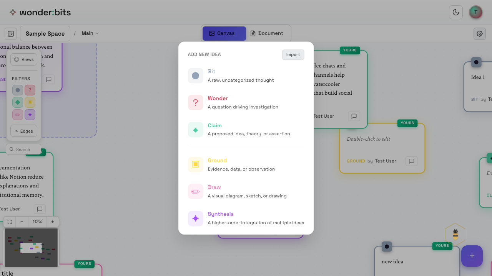
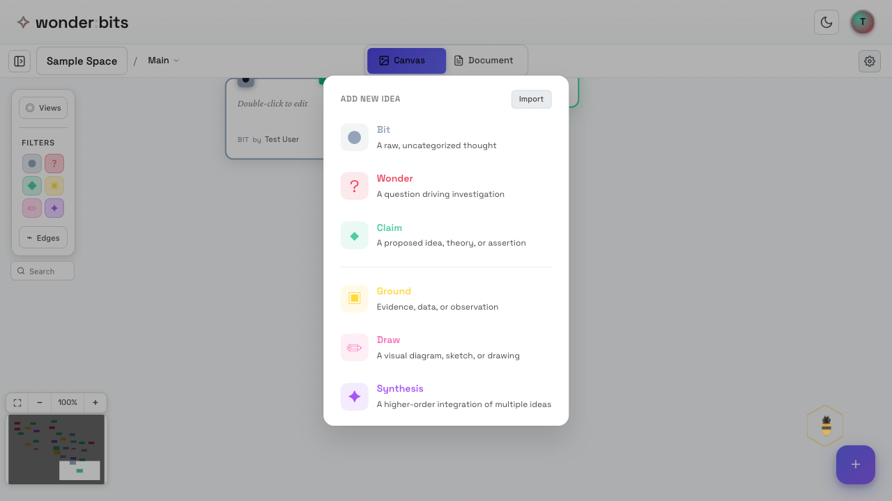
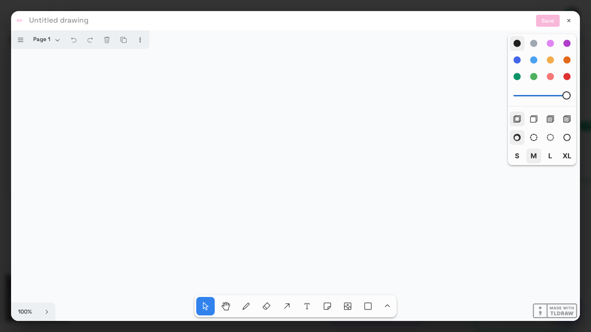

In Part 1, you learned about the basic node types: Wonder (questions), Claim (statements), and Bit (quick thoughts). Now let's explore the advanced node types that help you ground your thinking, synthesize ideas, and express yourself visually.

## Ground Nodes: Adding Evidence

**Ground nodes** are for evidence, sources, and supporting data. They help you anchor your claims and ideas in concrete facts.

### When to Use Ground Nodes

Use a Ground node when you want to:

- Cite a source or reference
- Add factual evidence to support a claim
- Include data, statistics, or observations
- Quote an expert or authority

*The type picker showing Ground in the advanced section*

<!-- 
*A Ground node* -->

### Connecting Ground to Claims

Ground nodes are most powerful when connected to Claims they support. 

<!-- 
*A Ground node ready to support a Claim* -->

Building on a Claim with a Ground node. This shows that your evidence supports your statement.

> **Tip:** Think of Ground nodes as the "foundation" of your thinking. Good arguments are built on solid evidence.

## Synthesis Nodes: Rising Above

**Synthesis nodes** represent higher-level insights that emerge from combining multiple ideas. They're for "rising above" -- seeing patterns and connections that weren't obvious before.

### When to Use Synthesis Nodes

Use a Synthesis node when you:

- Combine multiple ideas into a new insight
- Identify a pattern across several thoughts
- Draw a conclusion from your exploration
- Create a summary that captures the essence of related ideas

<!-- 
*Multiple ideas ready to be synthesized* -->

*Selecting Synthesis from the type picker*

<!-- 
*A Synthesis node representing a higher-level insight* -->

> **Tip:** Connect the ideas it synthesizes to your Synthesis node. This creates a visual structure showing how higher-level understanding builds on foundational ideas.
### The "Rise Above" Concept

In knowledge building, "rising above" means moving beyond individual ideas to see deeper patterns. Synthesis nodes help you:

- Move from specific examples to general principles
- Combine different perspectives into integrated understanding
- Create new knowledge that's more than the sum of its parts

> **Tip:** A powerful way to create syntheses is through Thinking Lab (an intermediate feature) that brings multiple ideas together to be worked on.

## Draw Nodes: Visual Thinking

**Draw nodes** let you sketch diagrams, doodles, and visual representations. Sometimes a picture expresses what words cannot.

### When to Use Draw Nodes

Use a Draw node when you want to:

- Sketch a diagram or flowchart
- Draw a concept map or visual relationship
- Create a quick illustration of an idea
- Express something that's hard to put into words

<!-- 
*Selecting Draw from the type picker* -->

### The Drawing Editor

When you create a Draw node, the drawing editor opens automatically. This full-screen editor gives you access to all drawing tools.

*The drawing editor*

### Drawing Tools

The drawing editor provides several tools:

- **Select** - Move and resize elements
- **Hand** - Pan around the canvas
- **Pencil** - Freehand drawing
- **Eraser** - Remove strokes
- **Arrow** - Draw arrows and connectors
- **Text** - Add labels and annotations
- **Shapes** - Rectangles, circles, and more

You can also choose colors and stroke sizes from the toolbar on the right.

<!-- 
*A Draw node on the canvas showing the preview* -->

### Reopening the Editor

To edit an existing Draw node, simply double-click on it to reopen the drawing editor. Your previous work will be preserved.

When you're done drawing, click **Save** or press Escape. Your drawing is saved and shown as a preview thumbnail in the node.

> **Tip:** Draw nodes are great for explaining processes, showing relationships visually, or just doodling to spark creativity.

## Combining Node Types

The real power of Wonderbits comes from combining different node types. A complete line of thinking might include:

- A **Wonder** that poses the question
- Several **Claims** that explore possible answers
- **Ground** nodes that provide evidence
- **Draw** nodes that illustrate concepts
- A **Synthesis** that captures the insight

<!-- 
*A canvas showing different node types working together* -->

Each node type serves a purpose in building understanding. Use them together to create rich, well-supported arguments and insights.

## Recap

In this section, you learned about three advanced node types:

1. **Ground Nodes** - For evidence, sources, and supporting data that anchor your claims
2. **Synthesis Nodes** - For higher-level insights that "rise above" by combining multiple ideas
3. **Draw Nodes** - For visual thinking, sketches, and diagrams

Next, you'll learn about **organizing your ideas** using clusters, pages, and views.

