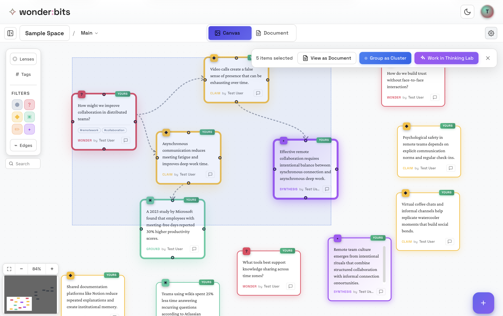
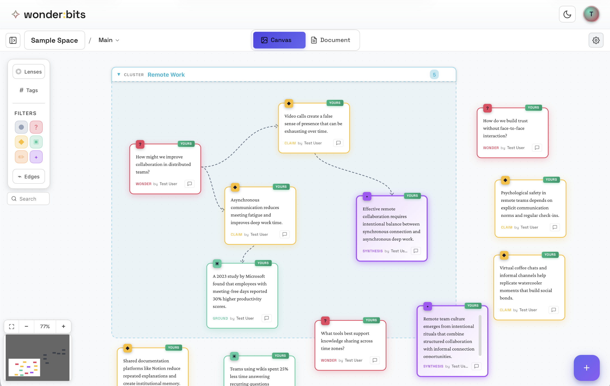
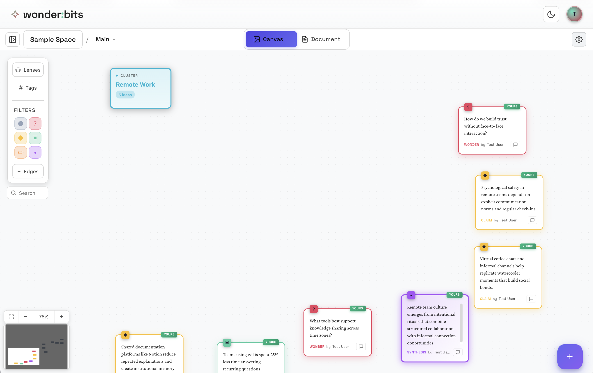
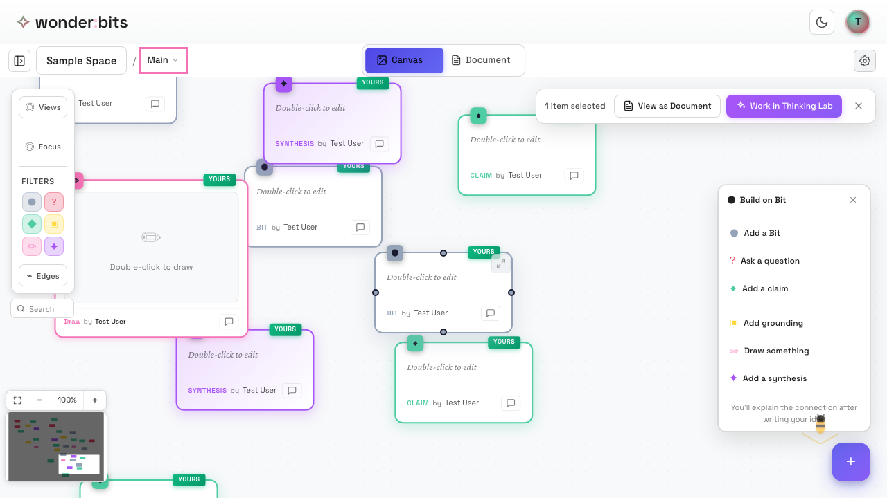
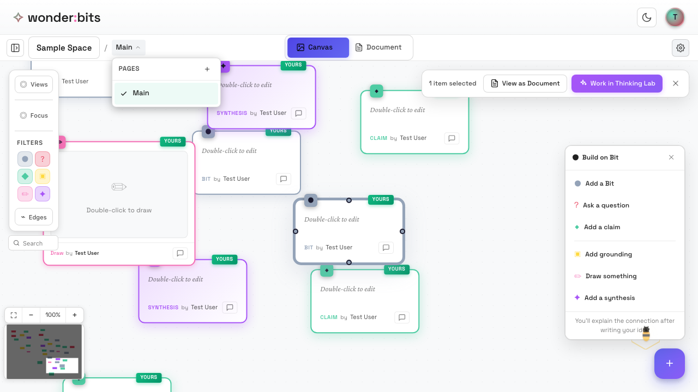
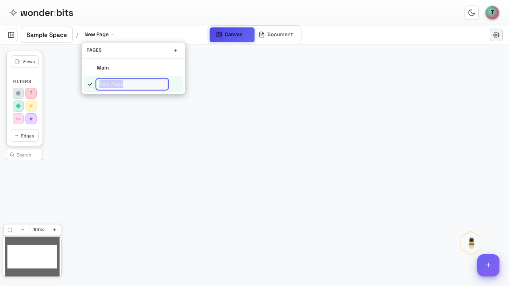

As your thinking grows, you'll need ways to organize your ideas. Wonderbits provides two powerful tools: **Clusters** for grouping related ideas, and **Pages** for organizing larger projects.

## Clusters: Grouping Related Ideas

**Clusters** let you visually group related ideas together. They create a boundary around a set of nodes, showing they belong together.

### When to Use Clusters

Use clusters when you want to:

- Group ideas that share a common theme
- Organize sub-topics within a larger exploration
- Visually separate different threads of thought
- Collapse a group of ideas to reduce visual clutter

<!-- 
*Several related ideas ready to be grouped* -->

### Creating a Cluster

To create a cluster, follow these steps:

1. Select multiple nodes (hold Shift/Cmd and click, or drag a selection box)
2. Look for the **Group as Cluster** button in the selection menu
3. Click the button to create the cluster

*The selection menu with Group as Cluster option*

> **Tip**: Multi-select can be also useful for viewing multiple ideas as Document, or sending them to be worked on in Thinking Lab.

### Naming Clusters

When you create a cluster, you can give it a meaningful name. Good cluster names describe the theme or topic that unites the ideas inside.

> **Tip:** Use descriptive names like "Evidence for X" or "Questions about Y" rather than generic names like "Group 1".

### Collapsing and Expanding Clusters

Clusters can be **collapsed** to save space on your canvas. A collapsed cluster shows just the name and count of ideas inside.

- **Collapse:** Click on the cluster header to collapse it
- **Expand:** Click on a collapsed cluster to expand and see all ideas inside

*A cluster can be collapsed or expanded*

Collapsing clusters is useful when you want to focus on other parts of your canvas without deleting your work.

*A cluster can be collapsed*

### Editing Clusters

You can edit a cluster at any time:

- **Rename:** Click the edit button (✎) on the cluster header
- **Change color:** Select a new color in the edit dialog
- **Remove nodes:** Drag nodes out of the cluster boundary

### Removing Nodes from Clusters

To remove a node from a cluster without deleting it:

1. Right-click on the node inside the cluster
2. Select **Remove from Cluster** from the context menu
3. The node will be placed outside the cluster on the canvas

## Pages: Organizing Large Projects

**Pages** let you divide a space into multiple canvases. This is useful for large projects where you want to separate different aspects of your thinking.

### When to Use Pages

Use pages when you want to:

- Separate different phases of a project
- Organize ideas by topic or category
- Keep your main canvas clean while exploring tangents
- Work on a large project that would be overwhelming on one canvas

*The current page selector in the header*

*The page dropdown showing available pages*

### Creating a New Page

To create a new page:

1. Click on the page selector in the header (shows current page name)
2. Click the **+** button in the dropdown header
3. Enter a name for your new page
4. The new page opens as a blank canvas

*A new page with a blank canvas*

### Switching Between Pages

To switch to a different page:

1. Click the page selector dropdown
2. Click on the page you want to view
3. The canvas updates to show that page's content

Each page maintains its own viewport (pan and zoom position), so you'll return to exactly where you left off.

### Moving Ideas Between Pages

To move an idea from one page to another:

1. Right-click on the node you want to move
2. Select **Move to Page** from the context menu
3. Choose the destination page
4. The node moves to that page

> **Tip:** You can also copy ideas between pages if you want to keep them in both places.

### Renaming and Deleting Pages

To manage your pages:

- **Rename:** Right-click on a page in the dropdown and select Rename
- **Delete:** Right-click and select Delete (you cannot delete the last page)

> **Note:** Deleting a page will also delete all ideas on that page. Be careful!

## Combining Clusters and Pages

Clusters and pages work together to help you organize at different scales:

- **Pages** = separate canvases for major topics or phases
- **Clusters** = groupings within a page for sub-themes

For example, a research project might have:

- **Page 1: Literature Review** - with clusters for different authors or themes
- **Page 2: Methods** - with clusters for different approaches
- **Page 3: Analysis** - with clusters for different findings

<!-- 
*A well-organized canvas using clusters* -->

## Recap

In this section, you learned about two organizational tools:

### Clusters

- Group related ideas visually
- Create by selecting multiple nodes and clicking Group as Cluster
- Can be named, collapsed, and edited
- Nodes can be removed from clusters without deleting them

### Pages

- Divide a space into multiple canvases
- Great for large projects with distinct sections
- Ideas can be moved or copied between pages
- Each page maintains its own viewport position

Next, you'll learn about **views and filters** to focus on specific parts of your thinking.

