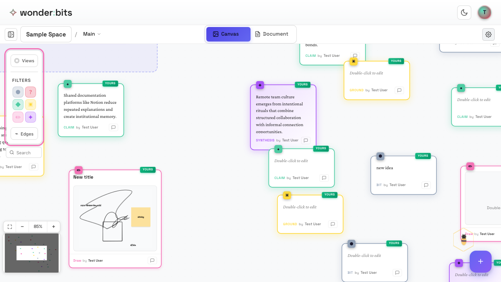
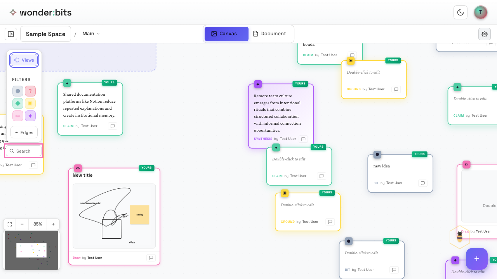
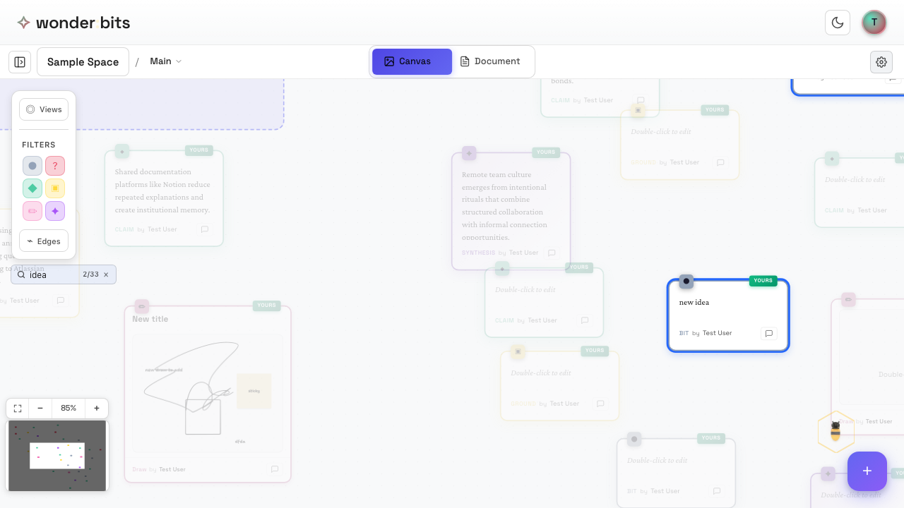
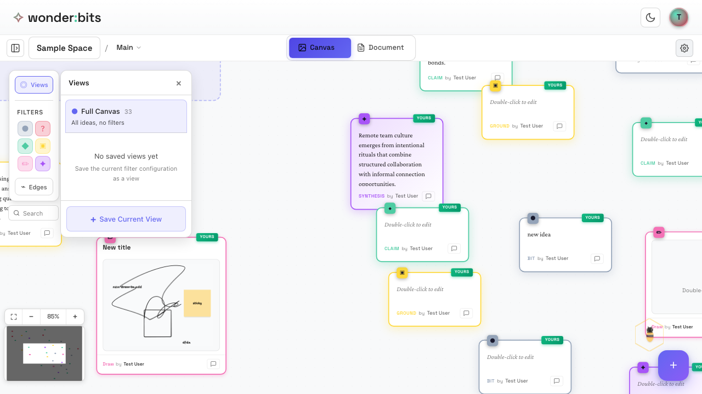
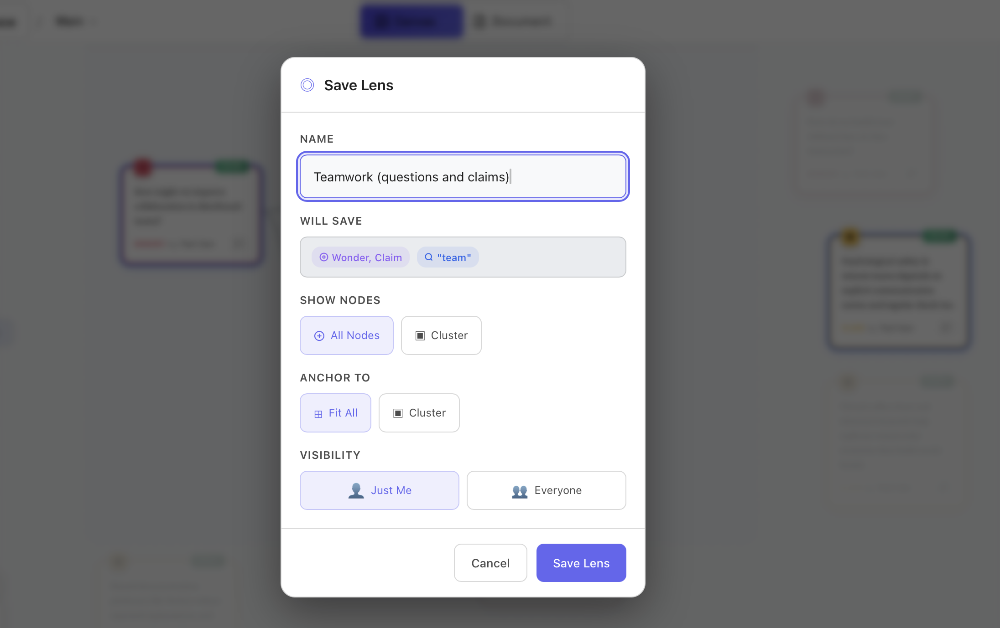
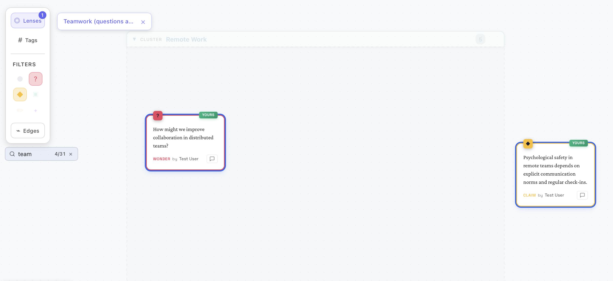

As your canvas grows with ideas, you'll want ways to focus on specific parts of your thinking. Wonderbits provides **filters**, **search**, and **saved lenses** to help you find and focus on what matters.

## Filtering by Node Type

The **Filters** panel in the left sidebar lets you show or hide ideas based on their type. This is useful when you want to focus on just questions, or just claims, etc.

*The canvas with the filters panel in the left sidebar*

### How Filters Work

The filter buttons show the different node types available:

- **Bit** (gray) - Untyped quick thoughts
- **Wonder** (pink) - Questions
- **Claim** (green) - Statements
- **Ground** (yellow) - Evidence
- **Draw** (orange) - Sketches
- **Synthesis** (purple) - Higher-level insights

### Using Filters

To filter your canvas:

1. Click on a node type button in the Filters section
2. Only ideas of that type will be highlighted
3. Other ideas become dimmed but remain visible
4. Click the same type again to remove the filter

### Multiple Filters

You can activate multiple type filters at once. When multiple filters are active, ideas matching **any** of the selected types are shown.

> **Tip:** Use filters to quickly scan all your questions (Wonder) or review all your evidence (Ground).

### Edge Filters

The **Edges** button lets you filter connections based on whether they have rationales (explanations for why ideas are connected).

- **All edges** - Show all connections
- **With rationale** - Show only connections that have explanations
- **Without rationale** - Show only connections lacking explanations

This is useful for reviewing your reasoning and finding connections that need more explanation.

## Search

The **Search** feature helps you find ideas by their content. It's the quickest way to locate specific thoughts in a large canvas.

*The search bar in the left sidebar*

### Basic Search

To search your canvas:

1. Click on the search box (or press Ctrl/Cmd + K)
2. Type your search term
3. Matching ideas are highlighted on the canvas
4. Non-matching ideas are dimmed

*Search results highlighting matching ideas*

<!-- ### Search Scope

You can control where search looks:

- **This Page** - Search only the current page
- **All Spaces** - Search across all your spaces (available on Home Page) -->

<!-- ### Saving Search as a View

If you find yourself searching for the same term often, you can save that search as a view. The view will remember your search query and show matching ideas whenever you load it. -->

> **Tip:** Combine search with type filters for powerful queries like "all questions containing 'design'".

## Saved Lenses

**Saved Lenses** let you save a combination of filters, search, and focus settings to return to later. Think of them as bookmarks for specific ways of looking at your canvas -- just like looking through a *lense*.

(Note: This feature used to be called *Views*, as you see in some images here.)

### Opening the Lenses Panel

Click the **Lenses** button at the top of the left sidebar to open the Lenses panel.

*The Lenses panel showing saved Lenses*

### What Lenses Can Save

A saved view remembers:

- Active type filters
- Search query (if any)
- Focus node (if focusing on a thread of ideas)
- Which nodes are visible

### Creating a Saved View

To create a saved view:

1. Set up your canvas with the filters, search, or focus you want
2. Click **Save Current Lense** (in the Lenses panel)
3. Give your lense a descriptive name
4. The lense is saved and appears in your Lenses panel

  
*Creating a saved lense focused on questions and claims about search term 'team'*

### Loading a Saved Lense

To load a saved lense:

1. Open the Lenses panel
2. Click on the lense you want to load
3. The canvas updates to show only the ideas in that lense

### Full Canvas View

The Lenses panel always shows a **Full Canvas** option at the top. Click this to clear all filters and show all ideas.

> **Tip:** Create Lenses for different phases of your thinking, like "Questions to explore" or "Key claims".

  
*Loading the saved lense focused on questions and claims about search term 'team'*

## Focus Mode

**Focus Mode** lets you zoom in on a single idea and its connections. This is useful for deep exploration of one thread of thought.

### Entering Focus Mode

To enter Focus Mode:

1. Select a node on the canvas
2. Click the **Focus** button that appears in the toolbar
3. The canvas shows only that node and its connected ideas

### Exiting Focus Mode

To exit Focus Mode:

- Click **Exit Focus Mode** in the toolbar, or
- Press Escape on keyboard

You can also save your focused view as a Saved Lense to return to it later.

## Recap

In this section, you learned about tools to focus your thinking:

### Filters

- Filter by node type to see only certain kinds of ideas
- Multiple filters can be active at once
- Non-matching ideas are dimmed, not hidden

### Search

- Find ideas by text content
- Control search scope (page, space, all spaces)
- Save frequent searches as Lenses

### Saved Lenses

- Save combinations of filters and settings
- Load Lenses to quickly return to a specific perspective
- Full Canvas clears all filters

### Focus Mode

- Focus on one idea and its connections
- Great for deep exploration
- Can be saved as a view

Next, you'll learn about **Document View** for reading your ideas in a linear format.

