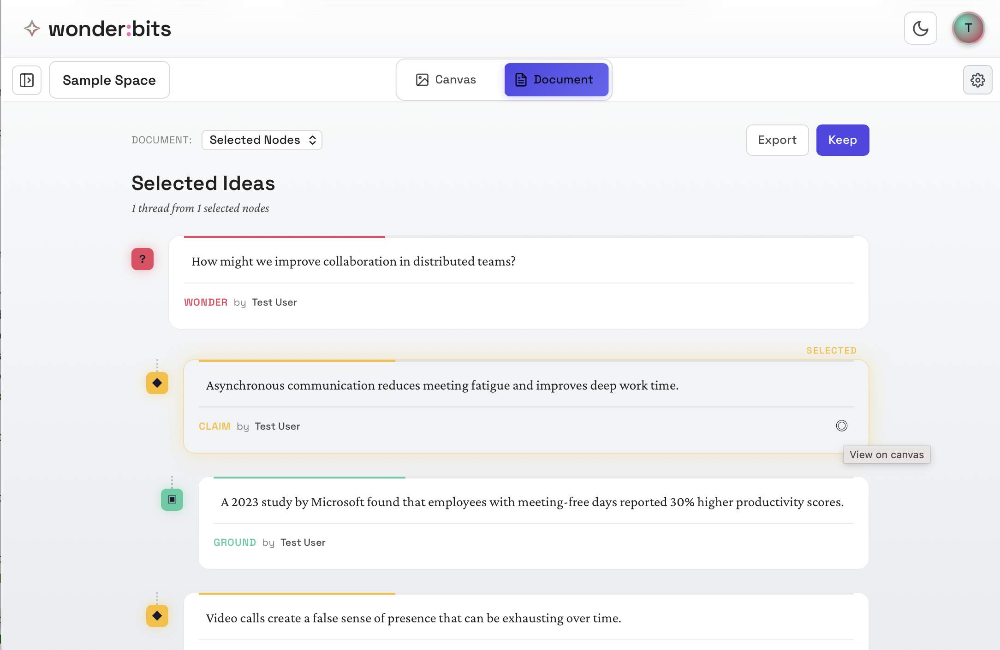
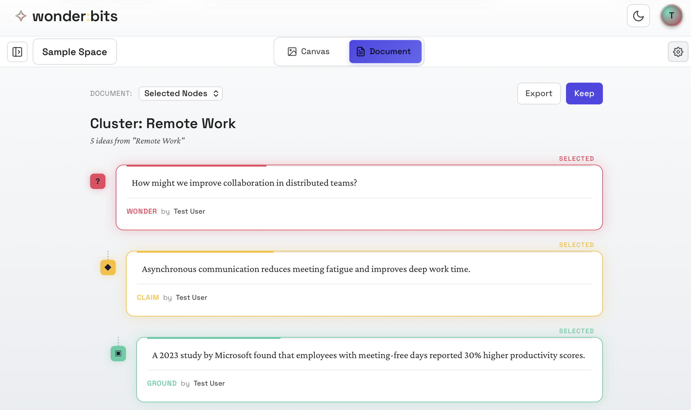
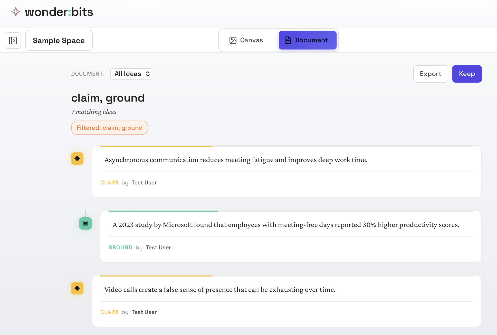
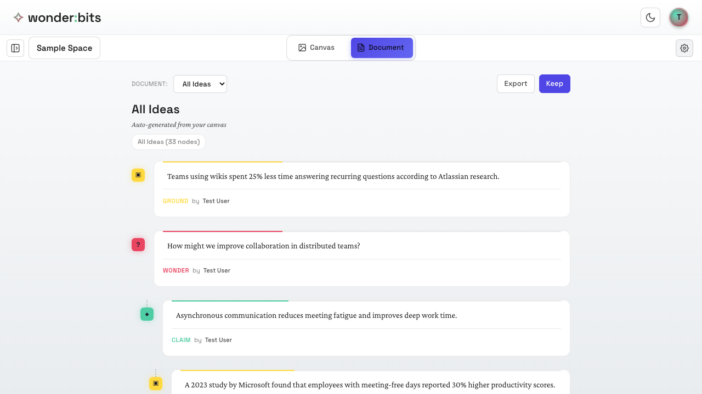
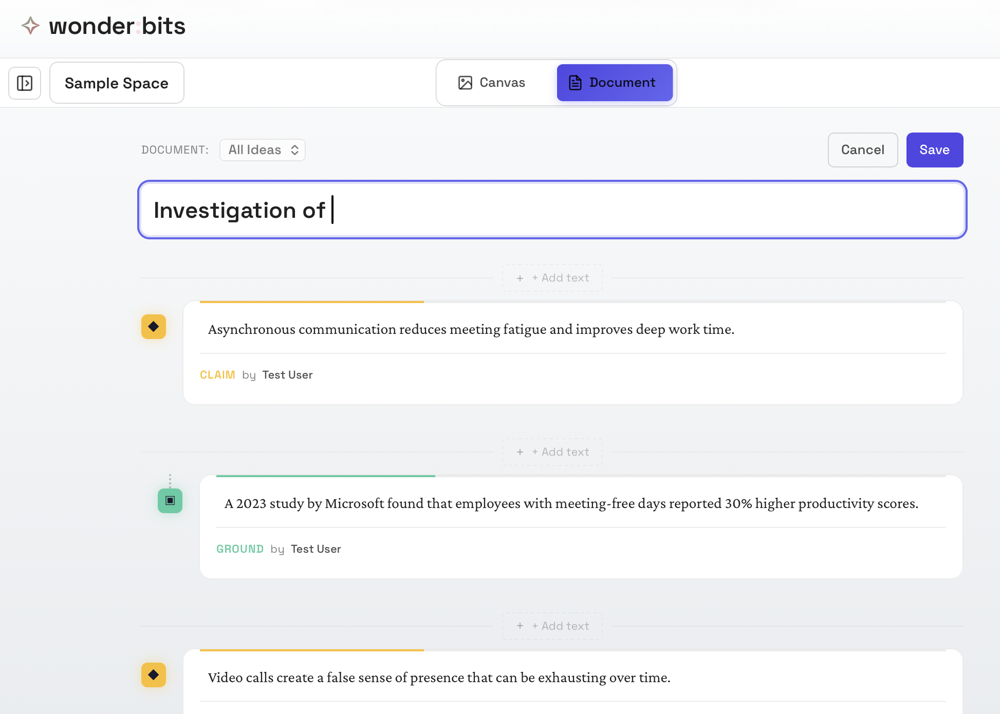
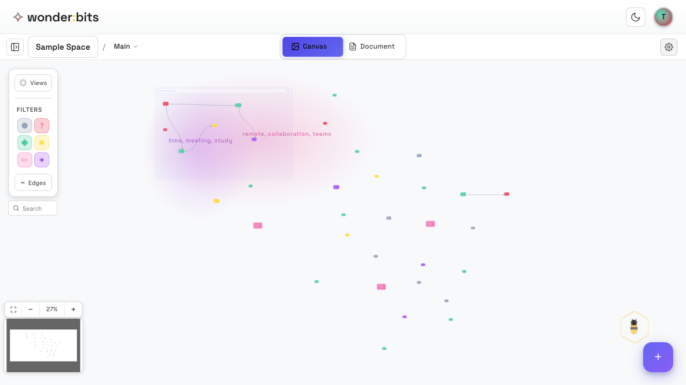

While Canvas view is great for exploring and organizing, sometimes you need to see your ideas in a **linear format**. Document View presents your ideas as a linear document, making it easier to read threads of thought and prepare presentations.

> **Tip:** Canvas View is still where most creative work happens. Document View is positioned to support reading and sense-making by representing ideas in this familiar threaded document format.

## Switching to Document View

The view toggle in the header lets you switch between Canvas and Document views.

<!-- 
*The Canvas/Document toggle in the header* -->

  
*Document View showing ideas in linear format*

In Document View, your ideas appear as a vertical list, making it easy to read through them like a document.

## What Document View Shows

Document View can display your ideas in several ways, depending on what you have selected on the canvas:

### All Ideas

By default, Document View shows **all ideas** from the current page, ordered chronologically (newest first or oldest first).

### Connected Ideas (Thread)

If you select a node on the canvas before switching to Document View, you'll see a **threaded view** showing that idea and all ideas connected to it. This follows the chain of connections to build a narrative.

### Selected Ideas

If you multi-select several nodes on the canvas, Document View shows just those selected ideas in order.

  
*Document View showing one selected idea and the "thread" it's part of*

For any idea in Document View, you can easily go back to where it is on Canvas View by clicking on the "View on canvas" button in the bottom-right corner.

### Cluster Contents

If you select a cluster, Document View shows all the ideas contained within that cluster.

*Document View showing one selected cluster*

### Filtered View

If you have type filters active, Document View shows only ideas matching those filters.

  
*Document View showing only claims and questions on the canvas*

### Document View controls

The Document View header provides controls for how your ideas are displayed:

The dropdown shows allows you to switch to other documents including saved ones.

## Keeping a Document to Build a Story

A **Story** is a saved arrangement of ideas that creates a narrative. While the default document view is generated automatically, stories let you curate and customize the sequence of ideas.

### Creating a Story

To create a story:

1. Set up your document with the ideas you want
2. Click **Keep** (or the save button)
3. Give your story a name and optional description
4. The story is saved and can be loaded later

*The Keep button to save a story*

### What Stories Remember

A saved story stores:

- Which ideas are included
- The order of ideas
- Any annotations you've added
- The story name and description

### Loading a Story

Saved stories appear in a dropdown in Document View. Select a story to load it and see the ideas in that saved order.

## Editing Stories

Once you've created a story, you can edit it to refine your narrative.

  
*Editing a story*

### Reordering Ideas

Drag ideas up or down in the list to change their order. This lets you arrange the narrative flow.

### Adding Annotations

**Annotations** are text notes you can add between ideas. Use them to:

- Introduce sections
- Explain transitions between ideas
- Add commentary or context
- Create headers for different parts of your narrative

To add an annotation:

1. Hover between two ideas in the story
2. Click the **+ Add text** button that appears
3. Type your annotation text

### Removing Ideas from a Story

To remove an idea from a story without deleting it from the canvas:

1. Hover over the idea in the document
2. Click the **×** or remove button
3. The idea is removed from the story but remains on your canvas

## Telling Stories

Stories are powerful for transforming scattered ideas into coherent narratives. Here are some ways to use them:

### Building an Argument

Create a story that moves from questions (Wonder) to evidence (Ground) to conclusions (Synthesis). Add annotations to guide the reader through your reasoning.

### Presenting Your Thinking

Use stories to prepare presentations. The linear format makes it easy to walk through ideas in order. Export your story as Markdown for use in other tools.

### Documenting a Process

Create a chronological story showing how your thinking evolved over time. This is useful for reflection and sharing your learning journey.

> **Tip:** You can have multiple stories in the same space, each presenting a different narrative with the same set of ideas.

## Exporting Documents

Document View lets you export your ideas in various formats:

- **Markdown** - For use in other writing tools
- **Plain Text** - Simple text format
- **Copy to Clipboard** - Quick sharing

This makes it easy to take your organized thinking and use it elsewhere. 

This could be telling your saved stories in front of your class or use your stories as the basis for writing a course paper. 

## Navigating Between Views

Document View and Canvas View work together:

### Canvas to Document

Select ideas on the canvas, then switch to Document View to see them in sequence.

### Document to Canvas

Click on any idea in Document View to locate it on the canvas. This helps you find the spatial context of an idea.

*Switching back to Canvas view*

## Recap

In this section, you learned about Document View:

### Document View Basics

- Switch between Canvas and Document using the header toggle
- Document View shows ideas in a linear, readable format
- What you see depends on your canvas selection and filters

### Stories

- Save a document as a Story to preserve the arrangement
- Reorder ideas and add annotations to craft your narrative
- Multiple stories can exist in the same space

### Storytelling

- Use stories to build arguments and presentations
- Navigate between Document and Canvas views
- Export your documents in various formats

---

**Congratulations!** You've completed Part 2 of the Wonderbits tutorial. You now know how to organize your thinking using advanced node types, clusters, pages, views, and document mode. In Part 3, you'll learn about **collaboration** - working with others in shared spaces.
