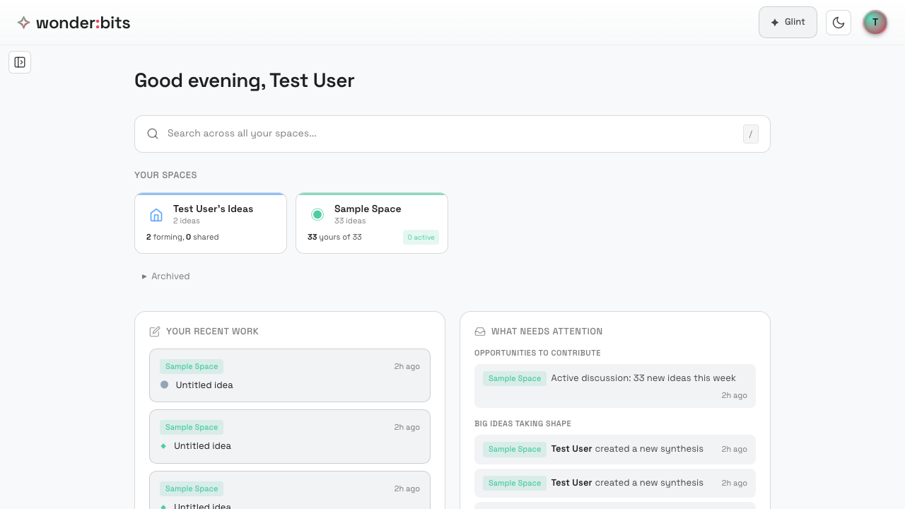
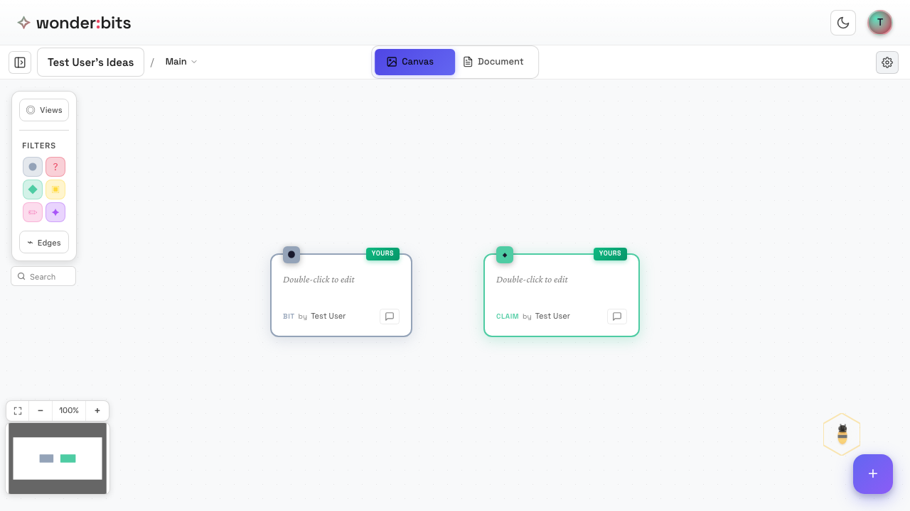

Wonderbits supports collaboration through **Class Spaces** - shared environments where multiple people can explore ideas together. This section covers how to create shared spaces, invite others, and collaborate in real-time.

## Personal vs Class Spaces

Wonderbits has two types of spaces:

### Personal Space

- Created automatically when you sign up
- Private to you - only you can see it
- Great for drafting ideas before sharing
- A safe place to explore without others watching

### Class Spaces

- Created by you or someone else
- Shared with invited members
- Everyone can see and contribute ideas
- Real-time collaboration with presence indicators

*The home page showing your spaces*

## Creating a Class Space

To create a new shared space for your class or team:

1. Click the **+ New Space** button on your home page
2. Enter a name for your space (e.g., "Biology 101" or "Design Team")
3. Optionally add a description
4. Click **Create Space**

Once created, your new space appears on your home page and you become its **owner**.

## Inviting Members

To invite others to your class space, you'll share an **invite code** or **invite link**.

### Getting the Invite Code

To find your space's invite code:

1. Open the space you want to share
2. Click the **Settings** (gear icon) in the header
3. Find the **Invite Code** section
4. Copy the code or the full invite link

*The space header with settings access*

### Sharing the Invite

Share the invite with your students or teammates:

- **Invite Link**: Share the full URL - they can click it to join directly
- **Invite Code**: Share just the code - they enter it when joining

### How Others Join

When someone receives your invite:

1. They click **+ New Space** on their home page
2. They switch to the **Join** tab
3. They enter the invite code
4. They click **Join Space**

After joining, the space appears on their home page and they can start contributing.

## Member Roles

Class spaces have two roles:

### Owner

- The person who created the space
- Can edit space settings (name, description)
- Can manage members
- Can delete the space
- Can archive the space

### Member

- Anyone who joined via invite
- Can view all ideas in the space
- Can create and edit their own ideas
- Can comment on any idea
- Can leave the space at any time

> **Note:** Members cannot edit or delete ideas created by others, but they can comment on them and build on them.

## Working Together

Class spaces enable real-time collaboration. Here's what you'll experience when working with others:

### Real-Time Updates

When someone adds, edits, or connects ideas, you see the changes immediately - no need to refresh. This makes collaboration feel alive and dynamic.

### Presence Indicators

The **presence avatars** in the header show who's currently viewing the space. Each person is represented by a colored circle with their initial.

- Colored circles show active users
- Click the avatars to see everyone's name
- The count shows how many people are online

*A class space showing collaboration features*

### Seeing Others' Ideas

In a class space, you can see everyone's ideas on the canvas. Each idea shows:

- The **author's name** at the bottom
- A **"YOURS"** badge on ideas you created
- The **node type** (Wonder, Claim, etc.)

> **Tip:** Look for ideas from classmates to build on - connecting your thinking to theirs creates richer discussions.

## Recap

In this section, you learned about Class Spaces:

### Space Types

- **Personal Space** - Private, just for you
- **Class Space** - Shared with invited members

### Creating and Joining

- Create spaces with the + New Space button
- Share the invite code or link with others
- Others join by entering the code

### Collaboration Features

- Real-time updates show changes instantly
- Presence avatars show who's online
- See ideas from all members on the shared canvas

Next, you'll learn about **sharing ideas** between spaces and commenting on each other's work.

