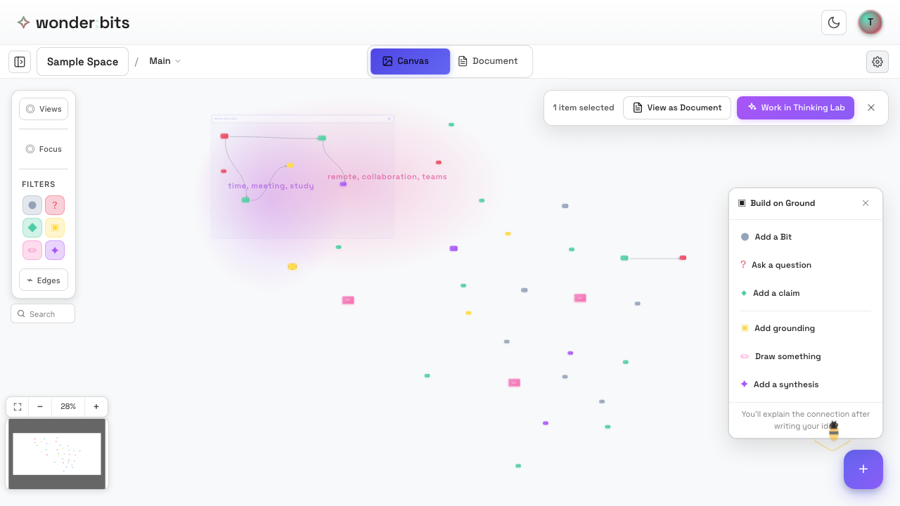
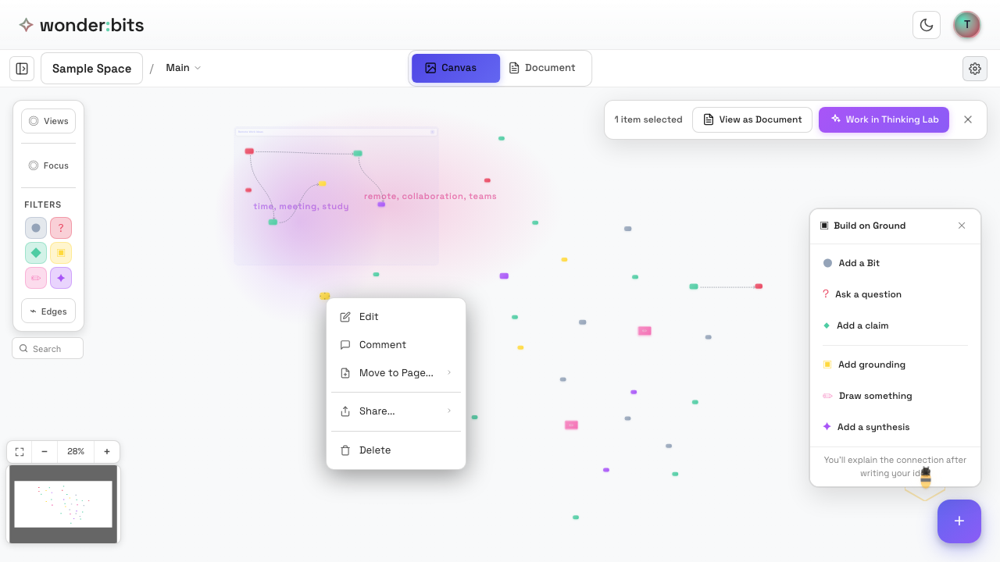
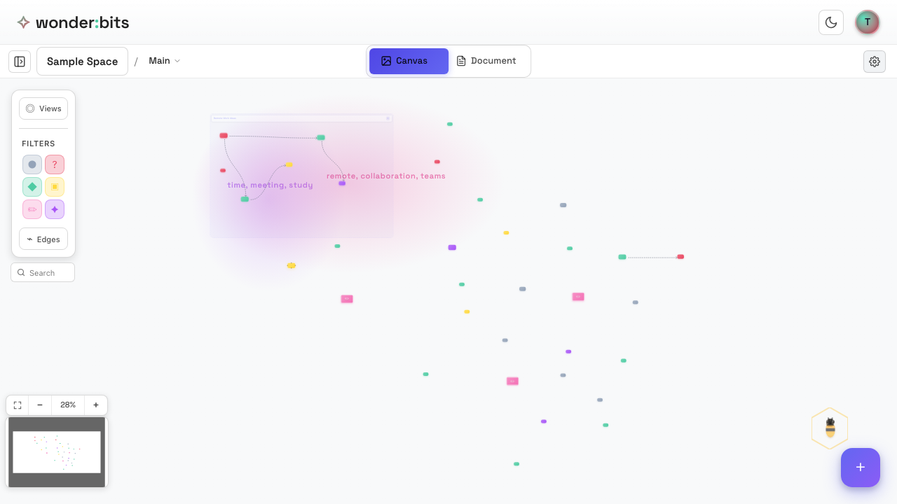

Collaboration in Wonderbits goes beyond just seeing others' ideas. You can **comment** on ideas, **share** them between spaces, and **import** ideas from classmates. This section covers all the ways to interact with shared ideas.

## Commenting on Ideas

Comments let you discuss ideas without modifying them. Use comments to ask questions, give feedback, or share your thoughts about someone's idea.

### Adding a Comment

To comment on an idea:

1. Click on the idea you want to comment on
2. Look for the **comment icon** (speech bubble) on the node
3. Click it to open the comments panel
4. Type your comment and press Enter or click Send

*An idea node showing the comment button*

### Comment Threads

Comments on an idea form a **thread**. Multiple people can reply, creating a discussion around the idea. The comment icon shows a count when there are comments.

### Viewing Comments

To see all comments on an idea:

- Click the comment icon on the node
- The comments panel opens on the side
- Scroll through the thread to read all comments
- Click outside or press Escape to close

> **Tip:** Use comments to ask clarifying questions, suggest improvements, or connect an idea to something else you've seen.

## Sharing Ideas Between Spaces

You can share ideas between your personal space and class spaces. This is useful for:

- Developing ideas privately before sharing
- Bringing interesting ideas from class to your personal space
- Contributing your best thinking to shared discussions

### Send vs Copy

There are two ways to share an idea:

#### Send

- **Moves** the idea to the destination space
- The idea now "lives" in the new space
- A reference stays in the original space
- Use this when you want to share your work with the class

#### Copy

- Creates an **independent copy** in the destination
- The original stays in its current space
- Both copies can be edited separately
- Use this when you want to work on variations

### How to Share an Idea

To share an idea to another space:

1. Right-click on the idea (or long-press on mobile)
2. Select **Share** from the context menu
3. Choose your destination space
4. Select **Send** or **Copy**

*The context menu with sharing options*

## Understanding References

When you **send** an idea to another space, the original location keeps a **reference** - a link to where the idea now lives.

### What References Show

- References appear slightly faded
- They show where the idea "lives" now
- Clicking a reference lets you navigate to the original
- References cannot be edited (the original can)

This system ensures that ideas have a clear "home" while still being visible in multiple places.

## Importing Ideas

In a class space, you can **import** ideas from classmates into your personal space. This lets you work with their ideas privately.

### Why Import?

- Build on a classmate's idea in your own space
- Create variations without affecting the original
- Collect interesting ideas for later reflection

### How to Import

To import someone else's idea:

1. Right-click on their idea in the class space
2. Select **Import to My Space**
3. A copy appears in your personal space
4. The original in the class space is unchanged

> **Note:** You can only import ideas from shared spaces - this option doesn't appear for your own ideas.

## Personal to Shared Workflow

A common workflow is to develop ideas privately, then share your best thinking:

1. **Draft** in your Personal Space - explore freely without pressure
2. **Refine** your ideas - edit, connect, and strengthen your thinking
3. **Send** to the Class Space - share your polished ideas with others
4. **Discuss** - comment on classmates' ideas and build on each other's work

This workflow lets you think privately before contributing to the shared discussion.

*A canvas showing ideas from multiple collaborators*

## Collaboration Best Practices

Here are some tips for effective collaboration:

### Be Constructive

- Use comments to build on ideas, not just critique
- Ask questions that help the author think deeper
- Offer suggestions, not just problems

### Build Connections

- Connect your ideas to classmates' ideas
- Look for patterns across different people's thinking
- Create synthesis nodes that combine perspectives

### Stay Organized

- Use clusters to group related ideas from different people
- Use pages to separate different topics or phases
- Use views to focus on specific contributors or themes

## Recap

In this section, you learned about sharing and collaboration:

### Comments

- Add comments to discuss ideas without editing them
- Comment threads enable ongoing discussions
- Use comments for questions, feedback, and connections

### Sharing Between Spaces

- **Send** moves an idea (leaves a reference)
- **Copy** creates an independent duplicate
- Right-click to access sharing options

### Importing

- Import copies others' ideas to your personal space
- Work privately with imported ideas
- Original ideas are unchanged

### Workflow

- Draft privately, then share to class
- Build on each other's ideas through connections and comments

---

**Congratulations!** You've completed Part 3 of the Wonderbits tutorial. You now know how to collaborate effectively using class spaces, comments, and sharing. In Part 4, you'll learn about the **AI Assistants** that can help guide your thinking.

